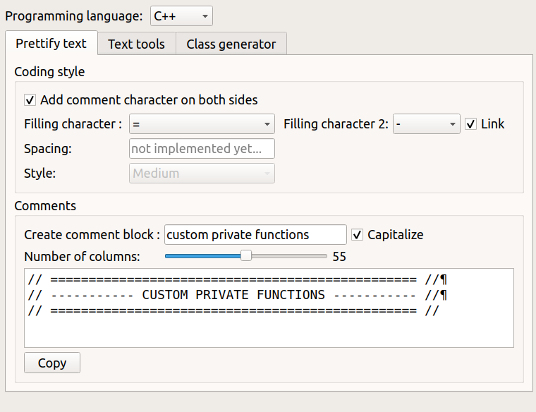
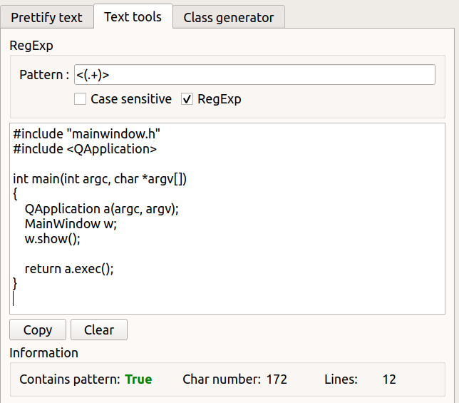

# code-helper

Programmers are lazy... they need tools ! 

# Apps 

## Contents table generator

File `gen_contents.py`. This parses Jupyter Notebooks and Markdown files to generate
a contents table with clickable links.

## CodeHelper executable

Currently implemented in C++, Python implementation in progress...

## Prettify code

## Text tools

